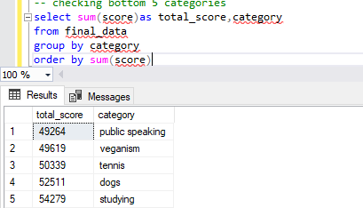

# Data Portfolio (Excel - SQL)

# Table of Contents
## Objective
## Data Source
## Analysis Tools
## Data Development
#### -Pseudocode
#### -Data Exploration
#### -Data Cleaning
## Data Quality Checks
## Data Anlaysis
## Data Visualisation
## Recommendations

# Objective
Accenture have embarked on a 3 month pilot with Social Buzz to focus on 3 main tasks, aligned with some of the biggest challenges thet are currently facing. Social Buzz has reached huge scale in recent years to become recognized as a global unicorn company. Firstly, the team will be doing an audit of your big data practice and sharing best practices and industry expertise. Secondly we will be guiding you through a successful IPO, of which we have deep expertise and knowledge of within our team. And finally, i have conducted an analysis of your data to find insights regarding social buzz's top 5 most popular categories of content.
## Data Source
Data of contents uploaded on social buzz was provided. For this analysis;
-Content ID is needed
-Content Category
-Reaction Type
-Reaction Score
-Content Categogry
-Content Type.
The datasets are attached to the doc file.
# Analysis Tools
| Tool | Purpose 
|------|-------------------------------------------|
|Excel | Exploring the data and visualisation      |                        
| SQL  | Cleaning, testing, and analyzing the data |

# Data Development
# Data Exploration 
#### This was the stage i scanned of what's in the data, errors, inconcsistencies, bugs and corrupted characters
#### I was provided with three datasets, the reaction dataset,content dataset and reaction types dataset
####  There are at least 4 columns in each dataset that contain the data we need for this analysis, which signals we have everything we need from the file without needing to contact the client for any more data.
#### We have more data than we need, so some of these columns would need to be removed.
# Data Cleaning 
#### The aim is to refine our dataset to ensure it is structured and ready for analysis.
#### The cleaned data should meet the following criteria:
#### - Contain neccasry columns for analysis
`` sql
/* Checking and Removing unneccasry columns*/
select *
from content;
--Removing user_id column;
ALTER TABLE content
DROP COLUMN user_id;
select * 
from content ``

#### - Each content id must be unique in the content table(no duplicates)

## - Total reactions recorded after removing blanks (24754)

## Below is a table outlining the features of our cleaned dataset:
| Dataet           | Numbers of Columns | DataType                           | Nullable|
|------------------|--------------------|------------------------------------|---------|
| ReactionTypes    | 3                  | Varchar,Varchar, Integer           | No      |
| Reactions        | 4                  | Integer, Varchar, Varchar, Date    | No      |
| Content          | 4                  | Integer, Varchar, Varchar, Varchar | No      |
# Data Quality Checks
## - Reaction type must be character,reaction score must be int,content category must be character

## - Column count, unique reaction types (16)

# Data Analysis
For this analysis, we're going to focus on the questions below to get the information we need for our client:
# - What are the top five category ?
To answer this, we need content id(content table and reactiontype table), content category column (content table), score column (reaction table), reaction type (reactiontypes table). To have all these column in a dataset, we need to join the three tables using sql

After having the needed column in a single table, futher analysis was carried out using count(sum) function in sql. The top five categories are Animals, Science, healthy eating, technology and food.

## - What are the bottom five category by scores ? The least five contents category are public speaking, veganism,tennis,dogs and studying

## - What is total count of contents by category ? Total number of contents uploaded on social buzz are shown below with Animals having the highest content of 1897 and public speaking with the least of 1217 

## - What is the most uploaded content type by score? The most uploaded content type is photos (282,848)

# Data Visualisation
Having answered our client questions, its important to put our analysis results in visuals that could be more understandable and communicable to client.
Using excel, we were able to visualise our analysis results ;
- What are the top 5 content categories

# Recommendations
With this result, its important to avoid Animal content being capitalized on, promoting other categories by collaborating with influencers or organizations in the  healthy eating, technology and food niche to amplify more engagements.
In conclusion, its important to keep tracking engagement patterns to identify new popular topics within these categories.
